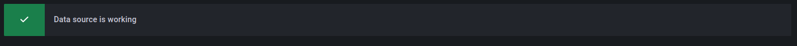
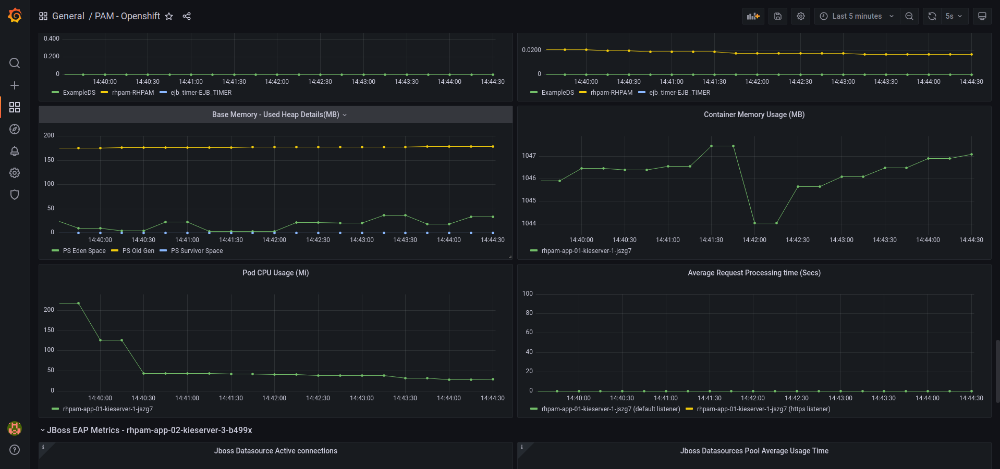

# RedHat Process Automation Manager Monitoring #

## Table of Contents ##
- [RedHat Process Automation Manager Monitoring](#redhat-process-automation-manager-monitoring)
  - [Table of Contents](#table-of-contents)
  - [Openshift Configuration](#openshift-configuration)
    - [Cluster Monitor Setup](#cluster-monitor-setup)
    - [Enable Prometheus Exporters on Kie-App](#enable-prometheus-exporters-on-kie-app)
    - [Add a new service for EAP Prometheus metrics](#add-a-new-service-for-eap-prometheus-metrics)
    - [Configure Service Monitor](#configure-service-monitor)
      - [Create the secret](#create-the-secret)
      - [Create the service monitor resource](#create-the-service-monitor-resource)
    - [Operator config map configuration](#operator-config-map-configuration)
  - [Grafana Configuration](#grafana-configuration)
    - [Data Source creation](#data-source-creation)
    - [Dashboard import](#dashboard-import)
  - [Grafana Dashboard details](#grafana-dashboard-details)
    - [Summary Dashboard](#summary-dashboard)
    - [PAM Runtime data Dashboard](#pam-runtime-data-dashboard)
    - [Container Runtime data Dashboard](#container-runtime-data-dashboard)
  - [External links](#external-links)

## Openshift Configuration ##

### Cluster Monitor Setup ###

Follow the [official documentation](https://docs.openshift.com/container-platform/4.6/monitoring/enabling-monitoring-for-user-defined-projects.html) for enabling the user workload monitoring.

### Enable Prometheus Exporters on Kie-App ###

The following environments must be added to Kie-App in order to enable prometheus exporters for PAM and EAP:


| NAME | VALUE | DESCRIPTION |
|------------|-------|-------|
| PROMETHEUS_SERVER_EXT_DISABLED|"false"|enable prometheus endpoint "services/rest/metrics" for kie-server |
|AB_PROMETHEUS_ENABLE|"true"|enable prometheus exporter for JBoss EAP on port 9799|

In addition the following java option must be added to enable datasource statistics monitor:

```
-Dwildfly.statistics-enabled=true
```
this is an example of the resulting kie-app

```yaml

apiVersion: app.kiegroup.org/v2
kind: KieApp
metadata:
  name: rhpam-app-01
  namespace: pam-monitor-01
spec:
  commonConfig:
    adminPassword: admin
    adminUser: adminUser
    keyStorePassword: wildcard
  environment: rhpam-authoring
  objects:
    console:
      keystoreSecret: rhpam-wildcard-keystore-secret
    servers:
    - database:
        type: postgresql
      env:
      # this env will enable PAM native prometheus endpoint
      - name: PROMETHEUS_SERVER_EXT_DISABLED
        value: "false"
      # this env will enable JBoss EAP prometheus exporter
      - name: AB_PROMETHEUS_ENABLE
        value: "true"
      jvm:
      # this option will enable statistics and related metrics for every subsystem (needed for datasource, ejb, http ...) 
        javaOptsAppend: -Dwildfly.statistics-enabled=true
      keystoreSecret: rhpam-wildcard-keystore-secret
      replicas: 1

```

### Add a new service for EAP Prometheus metrics ###

since the prometheus port isn't exposed by default a new service should be added to OpenShift Project

**Note:** the existing service could not be edited because it's being managed directly by the operator. In addition, if the new port will be added by forcing it trough operator's config map (like the jmx-exporter-config.yaml override) it will cause kie-server startup to fail.

in order to simplify the service monitor configuration, the labels:
- app
- application
- service
should be set with the same value already set in the existing service (the operator creates the service with the same name as the corresponding deployment config)

here is an example for a service related to the kie-app **rhpam-app-01** which will expose the default prometheus port (9799)

```yaml

apiVersion: v1
kind: Service
metadata:
  annotations:
    description: KIE server additional Prometheus ports. (KIE server)
  labels:
# the following labels are copied from the service named rhpam-app-01-kieserver
    app: rhpam-app-01
    application: rhpam-app-01
    service: rhpam-app-01-kieserver
  name: rhpam-app-01-kieserver-prometheus
  namespace: pam-monitor-01
spec:
  internalTrafficPolicy: Cluster
  ipFamilies:
  - IPv4
  ipFamilyPolicy: SingleStack
  ports:
  - name: prometheus
    port: 9799
    protocol: TCP
    targetPort: 9799
  selector:
# the selector must be the same of the service named rhpam-app-01-kieserver
    deploymentConfig: rhpam-app-01-kieserver
  type: ClusterIP
status:
  loadBalancer: {}

```

### Configure Service Monitor ###

The service monitor CR, allows to configure the endpoints scraped by Prometheus. For PAM we will have 2 different endpoints:

1. the endpoint exposed by EAP - Prometheus jmx exporter with context /metrics on port 9799 and without authentication
2. the endpoint exposed by PAM with context services/rest/metrics on http port (8080) with authentication (a valid kie-server user)

The configuration will be built upon:

- a secret with kie-server credentials
- the serviceMonitor configuration

#### Create the secret ####

in order to access kie server monitored endpoint, some valid credentials must be provided to ServiceMonitor collector, in this sample the default one will be used:

```bash
# Extract Admin User and password from kie-app
$ ADMIN_USER=$(oc get kieapp rhpam-app-01 -o json | jq -r .status.applied.commonConfig.adminUser)

# Extract Admin Password from kie-app 
$ ADMIN_PASSWORD=$(oc get kieapp rhpam-app-01 -o json | jq -r .status.applied.commonConfig.adminPassword)

#Verify the extracted credentials
$ echo $ADMIN_USER
adminUser

$ echo $ADMIN_PASSWORD
admin

```

after that the secret could be created

```bash
oc create secret generic rhpam-monitor-creds \
 --from-literal=username=${ADMIN_USER}
 --from-literal=password=${ADMIN_PASSWORD}

```
after this step a secret named rhpam-monitor-creds should be present in PAM namespace, this secret will be referenced in the ServiceMonitor configuration

#### Create the service monitor resource ####

```yaml

apiVersion: monitoring.coreos.com/v1
kind: ServiceMonitor
metadata:
  labels:
    name: kie-server-monitor
    service: rhpam-monitoring-kieserver
  name: kie-server-monitor
  namespace: pam-monitoring
spec:
  endpoints:
  # endpoint for collecting EAP metrics, no authentication required
  - path: metrics
    port: prometheus
  # endpoint for collecting PAM metrics, a valid username is required, it will be provided using the above secret
  - basicAuth:
      password:
        key: password
        name: rhpam-monitor-creds
      username:
        key: username
        name: rhpam-monitor-creds
    path: services/rest/metrics
    port: http
  selector:
    matchLabels:
      # this label must match the "service" label set  in both default(rhpam-app-01-kieserver-prometheus) and  prometheus(rhpam-app-01-kieserver-prometheus) services
      service: rhpam-monitoring-kieserver

```

After saving the configuration, the prometheus operator will upgrade its instances and after some time the metrics will be available.

### Operator config map configuration ###


This step is optional but if the kie-server is listening on https port, the default jmx-exporter-config.yaml monitor should be modified to export their metrics

## Grafana Configuration ##

The steps for configuring Grafana are:

- datasource creation
- dashboard import
- dashboard customization (if needed)

### Data Source creation ###

In order to create the Grafana datasource, first the Thanos Querier token and endpoint must be extracted from OpenShift:

according to [Openshift Documentation - Monitoring For user defined projects](https://docs.openshift.com/container-platform/4.6/monitoring/enabling-monitoring-for-user-defined-projects.html) the commands for extracting the Thanos Querier url and token are:


1.    Extract a token to connect to Prometheus:
```bash
    $ SECRET=`oc get secret -n openshift-user-workload-monitoring | grep  prometheus-user-workload-token | head -n 1 | awk '{print $1 }'`
```
```bash
    $ TOKEN=`echo $(oc get secret $SECRET -n openshift-user-workload-monitoring -o json | jq -r '.data.token') | base64 -d`
```
2.    Extract your route host:
```bash
    $ THANOS_QUERIER_HOST=`oc get route thanos-querier -n openshift-monitoring -o json | jq -r '.spec.host'`
```
3.    Test the extracted values by quering the metrics of your services in the command line. For example:
```bash
    $ NAMESPACE=pam-monitor-01

    $ curl -X GET -kG "https://$THANOS_QUERIER_HOST/api/v1/query?" --data-urlencode "query=up{namespace='$NAMESPACE'}" -H "Authorization: Bearer $TOKEN"
```
    The output will show you the duration that your application pods have been up.
    Example output

```json
{
  "status": "success",
  "data": {
    "resultType": "vector",
    "result": [
      {
        "metric": {
          "__name__": "up",
          "container": "rhpam-app-01-kieserver",
          "endpoint": "http",
          "instance": "10.217.0.60:8080",
          "job": "rhpam-app-01-kieserver",
          "namespace": "pam-monitor-01",
          "pod": "rhpam-app-01-kieserver-1-jszg7",
          "prometheus": "openshift-user-workload-monitoring/user-workload",
          "service": "rhpam-app-01-kieserver"
        },
        "value": [
          1637767954.774,
          "1"
        ]
      },
      {
        "metric": {
          "__name__": "up",
          "endpoint": "cr-metrics",
          "instance": "10.217.0.56:8686",
          "job": "business-automation-operator-metrics",
          "namespace": "pam-monitor-01",
          "pod": "business-automation-operator-55f56f5bd8-tm2fv",
          "prometheus": "openshift-user-workload-monitoring/user-workload",
          "service": "business-automation-operator-metrics"
        },
        "value": [
          1637767954.774,
          "1"
        ]
      },
      {
        "metric": {
          "__name__": "up",
          "endpoint": "http-metrics",
          "instance": "10.217.0.56:8383",
          "job": "business-automation-operator-metrics",
          "namespace": "pam-monitor-01",
          "pod": "business-automation-operator-55f56f5bd8-tm2fv",
          "prometheus": "openshift-user-workload-monitoring/user-workload",
          "service": "business-automation-operator-metrics"
        },
        "value": [
          1637767954.774,
          "1"
        ]
      },
      {
        "metric": {
          "__name__": "up",
          "endpoint": "prometheus",
          "instance": "10.217.0.60:9799",
          "job": "rhpam-app-01-kieserver-prometheus",
          "namespace": "pam-monitor-01",
          "pod": "rhpam-app-01-kieserver-1-jszg7",
          "prometheus": "openshift-user-workload-monitoring/user-workload",
          "service": "rhpam-app-01-kieserver-prometheus"
        },
        "value": [
          1637767954.774,
          "1"
        ]
      }
    ]
  }
}

```

4. Create Grafana Datasource

Open Grafana dashboard and select from the left menu the option **Configuration -> Data Sources**


In the Configuration screen click on **Add Data Source**


In the Add Data Source screen search for **Prometheus** and click on **Select**


Configure the settings:


| Field Name | Field Value | Note|
|------------|-------------|-----|
| Name       | Prometheus-openshift | |
| URL        | https:// **<thanos querier host extracted in step 2> **| |
| Skip TLS Verify| enabled | optional step, it could be enabled or not depends upon TLS Verify settings on Grafana Setup |
| Custom HTTP Headers | Add an header named Authorization and for value put *Bearer  + the token extracted on step 1 * | this workaround is necessary since the bearer auth is not in the default authentication methods|

click on **Save & test**


if everything is ok the following banner will be displayed




### Dashboard import ###

To import the dashboard


1. download the dashboard from [here](grafana/dashboard/PAM_OCP_Grafana_Dashboard.json)

2. from the Grafana homepage select **Create - Import**


3. click on **Upload JSON file**


4. In the summary screen click on "Import"


## Grafana Dashboard details ##

### Summary Dashboard ###

The first section of the dashboard is a per-namespace summary (or a comprehensive summary if "All" is selected for namespace):


The panels in the group are:

| Panel title | description | prometheus metric | 
|-------------|-------------| ---------------- | 
| Kie server state | Kie Server state | up|
| kie server start time | How long the Kie Server is running |  kie_server_start_time |
| Active containers | Number of active Kie server containers | kie_server_container_running_total | 
| Active deployments | Number of active Kie server deployments | kie_server_deployments_active_total |
| Running processes | Number of running processes (since server start) | kie_server_process_instance_running_total |
| Running cases | Number of running cases (since server start) | kie_server_case_running_total |
| Started processes | Number of started processes (since server start)  | kie_server_process_instance_started_total |
| Started Cases | Number of started cases (since server start) | kie_server_case_started_total |
| SLA Violations | Number of SLA violations (since server start)  | kie_server_process_instance_sla_violated_total |
| Execution Errors | Number of Execution errors  (since server start)  | kie_server_execution_error_total |
| Failed Tasks | Number of Failed Tasks (since server start) | kie_server_task_failed_total |
| Exited Tasks | Number of Exited Tasks (since server start)  | kie_server_task_exited_total |

**Note:**

the metrics are always related to server start time


### PAM Runtime data Dashboard ###


| Panel title | description | prometheus metric | 
|-------------|-------------| ---------------- | 
| Kie server state | Kie Server state | up|
| kie server start time | How long the Kie Server is running |  kie_server_start_time |
| Active containers | Number of active Kie server containers | kie_server_container_running_total | 
| Active deployments | Number of active Kie server deployments | kie_server_deployments_active_total |
| Running Jobs | Number of running Jobs | kie_server_job_running_total|
| Running Cases | Number of running Cases | kie_server_case_running_total |
| Running Processes | Number of running Process Insances | kie_server_process_instance_running_total
| Tasks Created | Number of Tasks created | kie_server_task_added_total|
| SLA Violations | Number of SLA violations (since server start)  | kie_server_process_instance_sla_violated_total |
| Execution Errors | Number of Execution errors  (since server start)  | kie_server_execution_error_total |
| Failed Tasks | Number of Failed Tasks (since server start) | kie_server_task_failed_total |
| Exited Tasks | Number of Exited Tasks (since server start)  | kie_server_task_exited_total |
| Started Processes | Number of started Process instances (since server start) | kie_server_process_instance_started_total | 
| Started Cases | Number of started case instances (since server start) | kie_server_case_started_total | 
| Registered Data Set Queries | Number of registered queries | kie_server_data_set_registered_total | 
| Running Data Set Queries | Number of running queries | kie_server_data_set_lookups_total | 
| Data Set Queries Time | Average query execution times | kie_server_data_set_execution_time_seconds_sum | 
| Data Set Query Executions | Number of queries Executed | kie_server_data_set_execution_time_seconds_count | 
| Started Process Over Time | Number of process started | kie_server_process_instance_started_total | 
| Process Average Time | Process average execution time | kie_server_process_instance_duration_seconds_sum | 
| Work Item Average Time | Work Items average execution time | kie_server_work_item_duration_seconds_sum | 
| Work Items Executions | Work Items execution count | kie_server_work_item_duration_seconds_count | 
| Case Average Time |  Cases average execution time | kie_server_case_duration_seconds_sum | 
| Task Average Time |  Tasks average execution time | kie_server_task_duration_seconds_sum |

**Note:**

the metrics are always related to server start time

### Container Runtime data Dashboard ###

the thrid section contains JBoss EAP and Container related metrics grouped by Pod:





| Panel title | description | prometheus metric | 
|-------------|-------------| ---------------- | 
| Jboss Datasource Active connections | Number of Active JDBC connection per pool | jboss_datasources_pool_active_count | 
| Jboss Datasources Pool Average Usage Time | JDBC connection average usage time | jboss_datasources_pool_average_usage_time_seconds |
| Base Memory - Used Heap Details(MB) | JVM used heap details | jvm_memory_pool_bytes_used
| Container Memory Usage (MB) | Container memory usage | container_memory_usage_bytes |
| Pod CPU Usage (Mi) | Container CPU usage | container_cpu_usage | 
| Average Request Processing time (Secs) | Average HTTP(s) request processig time | jboss_undertow_processing_time_total /jboss_undertow_request_count_total |

**Note:**

the metrics are always related to server start time


## External links ##

[OpenShift - Understanding the monitoring stack](https://docs.openshift.com/container-platform/4.6/monitoring/understanding-the-monitoring-stack.html)

[OpenShfit - Configuring the monitoring stack](https://docs.openshift.com/container-platform/4.6/monitoring/configuring-the-monitoring-stack.html)

[OpenShift - Enabling monitoring for user-defined projects](https://docs.openshift.com/container-platform/4.6/monitoring/enabling-monitoring-for-user-defined-projects.html)

[RedHat Process Automation Manager Documentation](https://access.redhat.com/documentation/en-us/red_hat_process_automation_manager/7.11)

[Prometheus metrics monitoring in Red Hat Process Automation Manager](https://access.redhat.com/documentation/en-us/red_hat_process_automation_manager/7.11/html/managing_red_hat_process_automation_manager_and_kie_server_settings/prometheus-monitoring-con_execution-server)

[Grafana Official WebSite](https://grafana.com/)

[Prometheus JMX Exporter](https://github.com/prometheus/jmx_exporter)

[jmx-exporter-config.yaml default file](https://github.com/jboss-container-images/jboss-kie-modules/blob/main/jboss/container/eap/prometheus/config/7.2/artifacts/opt/jboss/container/prometheus/etc/jmx-exporter-config.yaml)
